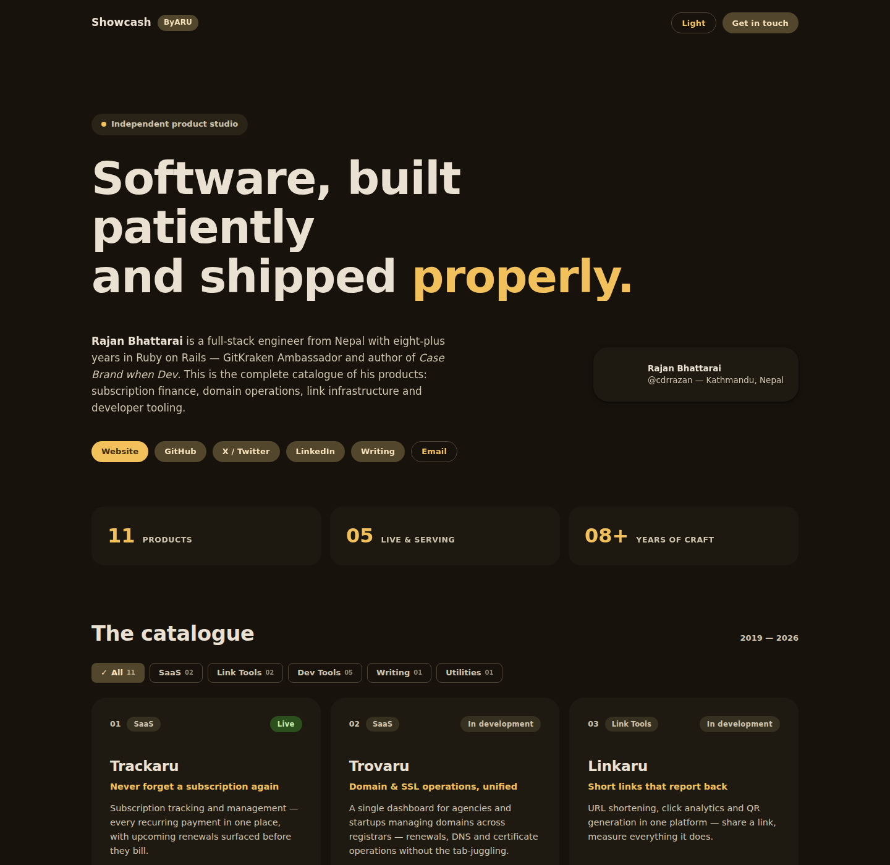
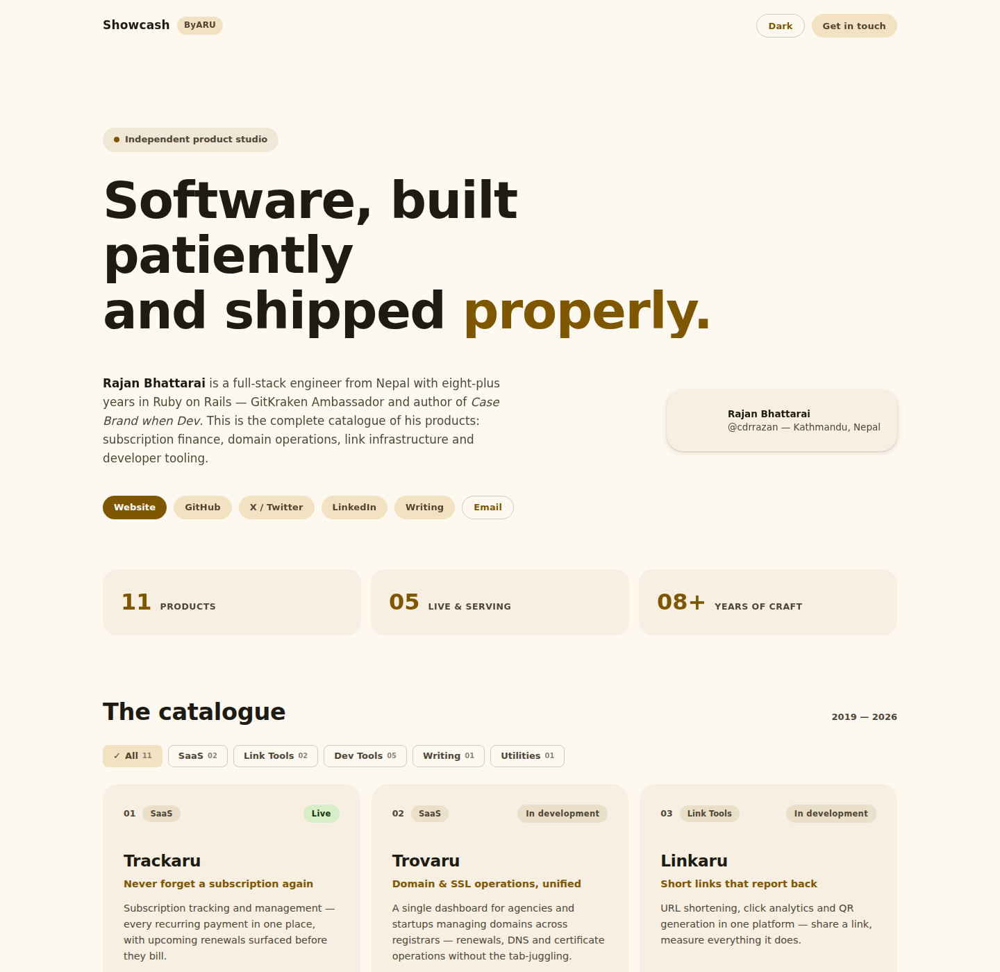
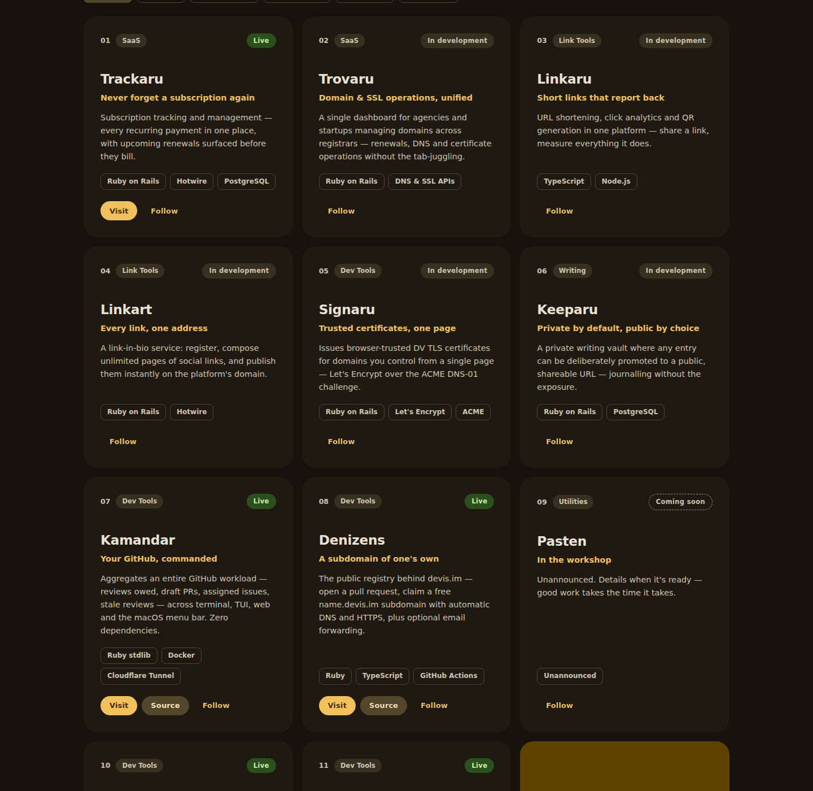

<div align="center">


<br><br>

[](https://cdrrazan.com)
[](https://github.com/cdrrazan)
[](https://x.com/cdrrazan)
[](https://www.linkedin.com/in/cdrrazan)
[](https://dev.to/cdrrazan)

<br>

*The complete product catalogue of* **Rajan Bhattarai** *— full-stack Rails engineer,*
*GitKraken Ambassador, and author of* Case Brand when Dev*.*

</div>

<br>

## Preview

<div align="center">

<br><br>

<br><br>

</div>

<br>

## The catalogue

| № | Product | Category | What it is | Stack | Status |
|---|---|---|---|---|---|
| 01 | **[Trackaru](https://trackaru.com)** | SaaS | Subscription tracking — never miss a payment | Rails | Live |
| 02 | **Trovaru** | SaaS | Domain & SSL operations for agencies | Rails | In development |
| 03 | **Linkaru** | Link Tools | URL shortening, analytics & QR codes | TypeScript | In development |
| 04 | **Linkart** | Link Tools | Link-in-bio pages, unlimited & instant | Rails | In development |
| 05 | **Signaru** | Dev Tools | Browser-trusted TLS certs via Let's Encrypt | Rails · ACME | In development |
| 06 | **Keeparu** | Writing | Private writing vault, public by choice | Rails | In development |
| 07 | **[Kamandar](https://kamandar.byaru.com)** | Dev Tools | Personal GitHub command center | Ruby stdlib | Live |
| 08 | **[Denizens](https://devis.im)** | Dev Tools | Free `name.devis.im` subdomains & aliases | Ruby · TS · Actions | Live |
| 09 | **Pasten** | Utilities | In the workshop | — | Coming soon |
| 10 | **[Roost](https://roost.pages.dev)** | Dev Tools | Local apps → live HTTPS on your own domain | Go · Docker · Caddy | Live |
| 11 | **[Boardly](https://boardly-gh.pages.dev)** | Dev Tools | GitHub Projects boards on autopilot | TS · Actions | Live |

The catalogue is filterable by category on the page itself.

## Running locally

One self-contained `index.html`. No build step, no dependencies, no framework.

```sh
open index.html          # just open it
python3 -m http.server   # …or serve it → http://localhost:8000
```

## Design notes

- **Material 3** — warm gold tonal palette, rounded surface cards in a
  gapped grid, filter chips, pill buttons with state layers, elevation
  on hover, Google Sans throughout
- **Dark & light** — follows the system preference, with a manual toggle
  persisted in `localStorage`; warm dark surfaces or warm paper light
- **Data-driven** — products live in one JS array; the grid renders from it
- **Quiet motion** — staggered scroll reveals via `IntersectionObserver`,
  understated hover states, full `prefers-reduced-motion` support
- **Zero dependencies** — plain HTML, CSS and vanilla JS

<br>

<div align="center">

*Built by [Rajan Bhattarai](https://cdrrazan.com) · [@cdrrazan](https://x.com/cdrrazan)*

</div>
